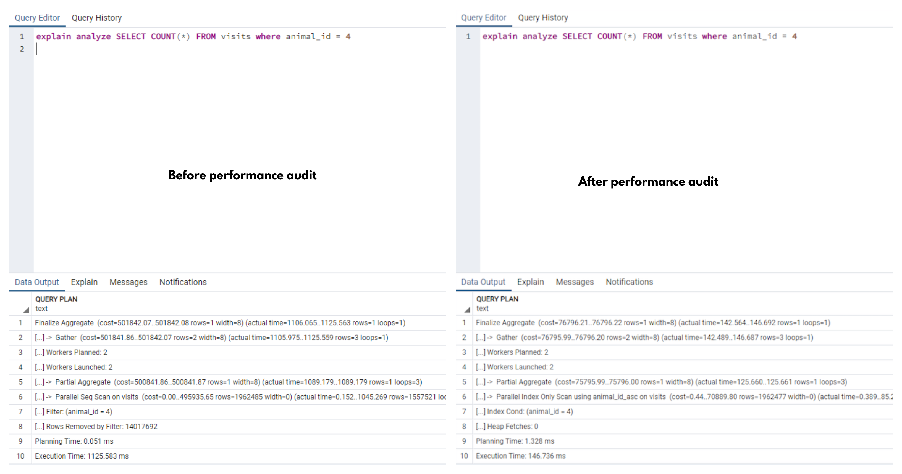
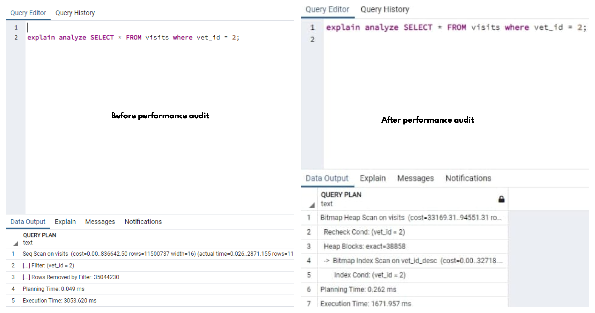
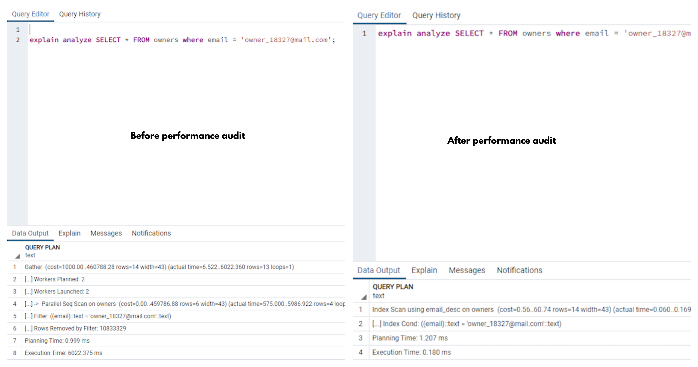

# Vet clinic database

> A database SQL file for vet clinic visitors and pets

In this exercise we are implementing performance improvements on the sql databases

## Built With

- postgreSQL
- SQL
- Pg Admin

## Getting Started

To get a local copy up and running follow these simple example steps.

### Prerequisites
 - Postgres
 - PG Admin
 - Terminal

### Usage
 Clone the project by typing in your terminal `git clone https://github.com/SunnySparks/Vet-clinic-database.git`.

 - Change directory `cd` into the folder just created from the project.

 - Open postgreSQL
 - Create the database using the `schema.sql` file
 - Add the email column inside the owners table by typing `ALTER TABLE owners ADD COLUMN email VARCHAR(120);`
 - Populate your database by adding the following commands `INSERT INTO visits (animal_id, vet_id, date_of_visit) SELECT * FROM (SELECT id FROM animals) animal_ids, (SELECT id FROM vets) vets_ids, generate_series('1980-01-01'::timestamp, '2021-01-01', '4 hours') visit_timestamp;` and `insert into owners (full_name, email) select 'Owner ' || generate_series(1,2500000), 'owner_' || generate_series(1,2500000) || '@mail.com';` 
 - To check the performance, run

 `explain analyze SELECT COUNT(*) FROM visits where animal_id = 4;`

`explain analyze SELECT * FROM visits where vet_id = 2;`

`explain analyze SELECT * FROM owners where email = 'owner_18327@mail.com';`

## Authors

👤 **Sunny Díaz**

- GitHub: [@SunnySparks](https://github.com/SunnySparks)
- Twitter: [@JosfranT6](https://twitter.com/JosFranT6)
- Instagram: [@webdev.sunnydiaz](https://www.instagram.com/webdev.sunnydiaz/)
- Portfolio: [sunnydiaz.com](https://sunnydiaz.com/)
- LinkedIn: [LinkedIn](https://www.linkedin.com/in/jose-f-silva/)

👤  **Rocio Martinez** 
- Github: [@Rocio01](https://github.com/Rocio01) 
- Twitter: [@rugiada8801](https://twitter.com/rugiada8801) 
- Linkedin: [zulma-rocio-martinez](https://www.linkedin.com/in/zulma-rocio-martinez)

Contributions, issues, and feature requests are welcome!

Feel free to check the [issues page](https://github.com/SunnySparks/Vet-clinic-database/issues).

## Show your support

Give a ⭐️ if you like this project!

## Acknowledgments

- Use of SQL databases
- Improvement on database queries performance

## 📝 License

This project is [MIT](./MIT.md) licensed.
